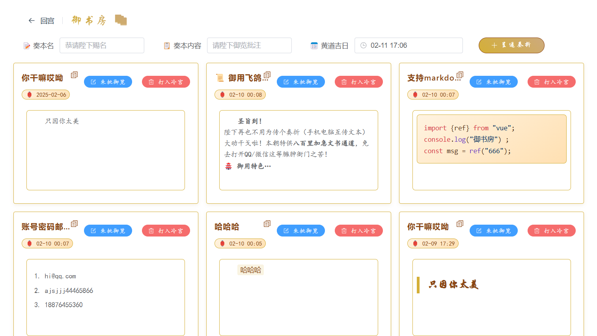

# 🏮 御书房·极速砍刀传 🏮

> **朕の代码江山 | 一款御批风格的网络剪贴簿工具**  
> **御赐GitHub地址** 👉 [御书房](https://github.com/ddddelong/netcut)  
> **御用技术栈**：Vue3 + Element-Plus + 皇家秘制API

---

## 📜 圣旨摘要

```
奉天承运皇帝诏曰：
  朕御笔亲批此项目，实乃21世纪最伟大之数字玉玺。文武百官可速速clone，不得有误！
钦此！✨
```

---

## 🛠 登基大典筹备指南

### 御膳房传膳 (安装依赖)
```bash
npm install  # 速速给朕装好贡品！
```

### 开启早朝 (开发模式)
```bash
npm run dev  # 众爱卿速来觐见！
```

### 修建行宫 (生产构建)
```bash
npm run build  # 给朕修得金碧辉煌！
```

---

## 🖋️ 御批功能实录

### 御书房特色
- **奏本批阅系统** 📜：仿圣旨样式编辑器，批阅如行云流水
- **皇家安防** 🛡️：玉玺级加密登录，密码遗失者斩立决
- **时光宝盒** 🕰️：黄道吉日选择器，助你择良辰吉时
- **皇家快递** 🐎：八百里加急同步，比汗血宝马更快
- **翰林院文书处理** 📝：奏折支持[翰林院专用标记法](https://commonmark.org/)
- **七彩琉璃代码高亮** 🌈：采用highlight.js御用着色方案

### 百官操作指南
```javascript
// 上奏折的正确姿势
const 奏折 = {
  标题: "请陛下拨款买奶茶",
  内容: "臣夜观星象，需珍珠奶茶续命...",
  吉时: "未时三刻"
}
await 陛下.批阅(奏折); // 🤴✨
```

---

## 🏗️ 内阁成员

- **首席大太监** 👨💻：负责端茶倒水写代码
- **御前带刀侍卫** 🔧：专职修bug和砍需求
- **钦天监监正** 🎨：UI设计兼风水测算

---

## ⚠️ 朝堂纪律

1. 禁止在奏折里写`console.log(陛下坏话)`
2. 遇bug需三跪九叩后提交issue
3. PR需附上三字经格式的commit message
4. 项目启动时需高呼"陛下圣明"

---

## 🎁 彩蛋功能

- 连续加班提醒：自动播放《朕的江山完了》BGM
- 代码报错时：弹出"来人！拖出去斩了！"动画
- 深夜提交代码：触发隐藏款夜猫子模式🏙️
- **御赐摸鱼模式** 📱：移动端自动切换奏折批阅界面
- **早朝模式** 🖥️：PC端展示完整奏折墙
- **圣上亲巡** 📐：响应式布局随驾自动调整

---

## 🎩 翰林院文书规范
```markdown
# 奏折模板

**标题**：请陛下{{ 事由 }}

**正文**：

1. 事件缘由：{{ 原因 }}
2. 所需银两：{{ 金额 }}两
3. 黄道吉日：{{ 日期 }}


**落款**：  
臣 {{ 姓名 }} 跪奏
```

## 📱 御驾亲征演示

  

*（圣上批阅奏折实况，5G加急传送）*

---

## 🐉 龙颜大怒处理方式

若遇圣驾崩溃，请依次尝试：
1. 焚香沐浴更衣
2. 三呼"陛下息怒"
3. 执行 `npm run build`  --祭天
4. 进贡奶茶一杯 ☕

---

**御用技术支持**：  
![玉玺印章]  
**传国玉玺认证** · **永保代码昌盛**


 

（注：实际效果比示意图更震撼，建议亲自[临幸](https://netcut.deno.dev/)）
---
> 朕的承诺：凡star本仓库者，皆可获封"代码护国公"爵位，世袭罔替！

## 🏰 行宫建造须知

> **重要圣谕**  
> 本行宫为**前朝建筑**，需配合朕的云上御书房使用

### 登基流程
1. 执行 `npm run build` 修建行宫
2. 将生成的`dist`目录进贡至御用服务器
3. 连接朕的云上御书房API（已内置）

### 自建行宫指南
若想自建后宫...啊不，自建服务：
```bash
# 1. 请先克隆朕的云上御书房
git clone https://github.com/ddddelong/netcut-api

# 2. 安装贡品
deno install

# 3. 启动皇家驿站
deno run dev
```

---

## 📡 朝贡体系
- **前朝**：本仓库（用户界面）
- **后宫**：[netcut-api](https://github.com/ddddelong/netcut-api)（数据服务）
- **通信方式**：RESTful-express飞鸽传书

---

## 🚨 重要告示
> 本地预览时需**修建行宫后**方可使用，直接`npm run dev`会遭遇：
> - 奏折无法上呈 📜
> - 玉玺验证失效 🔐
> - 圣驾显示异常 👑

### (README由有趣的灵魂——deepseek生成，如有雷同，纯属巧合哈哈哈哈哈)